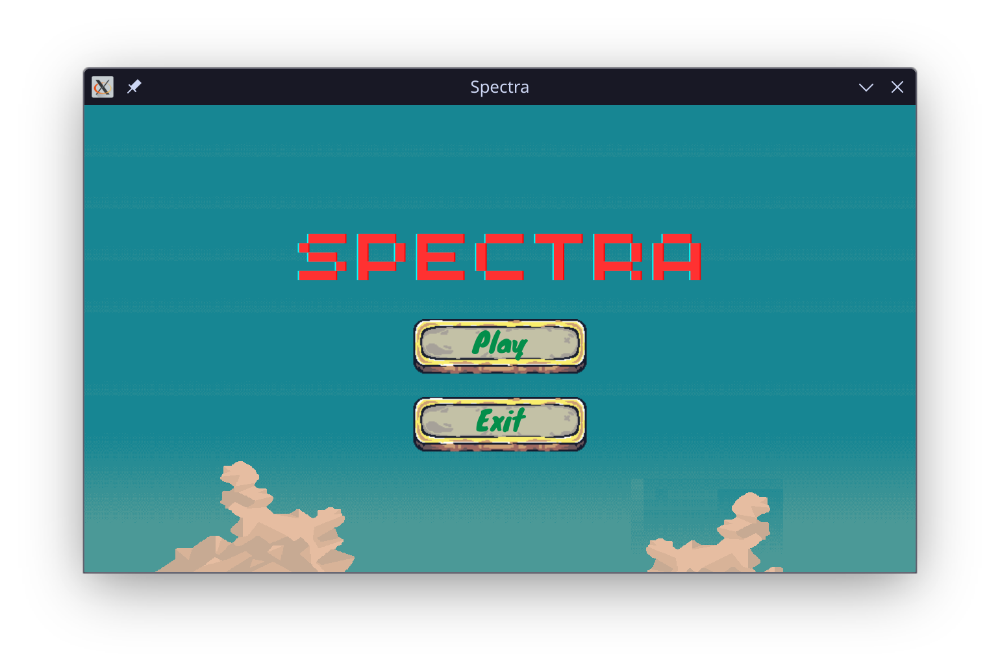
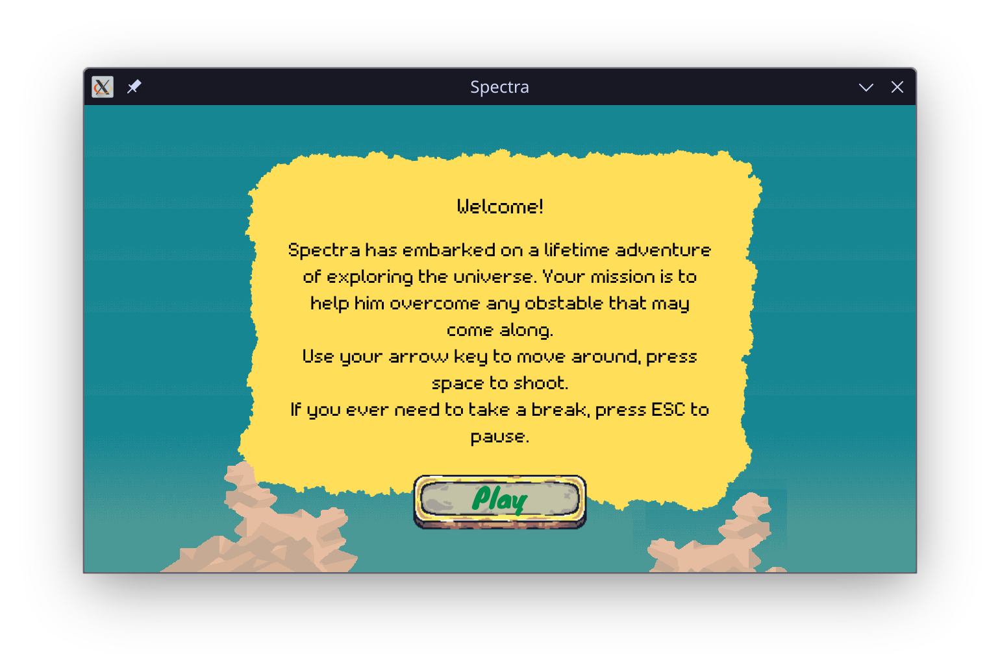
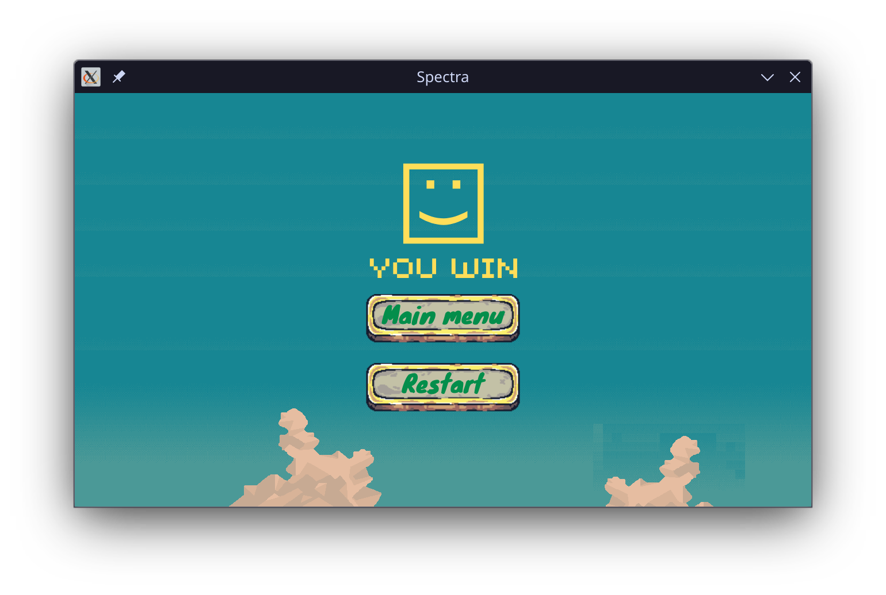
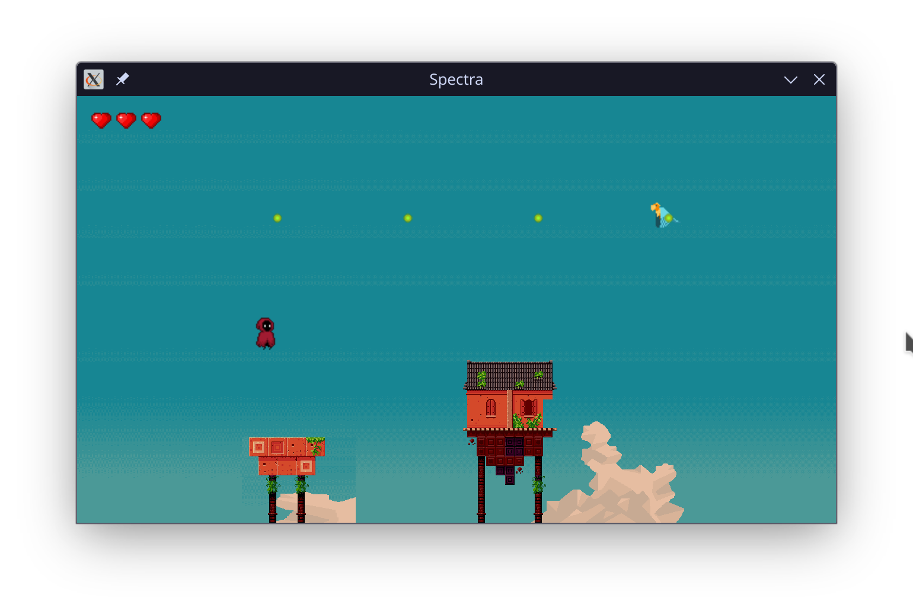
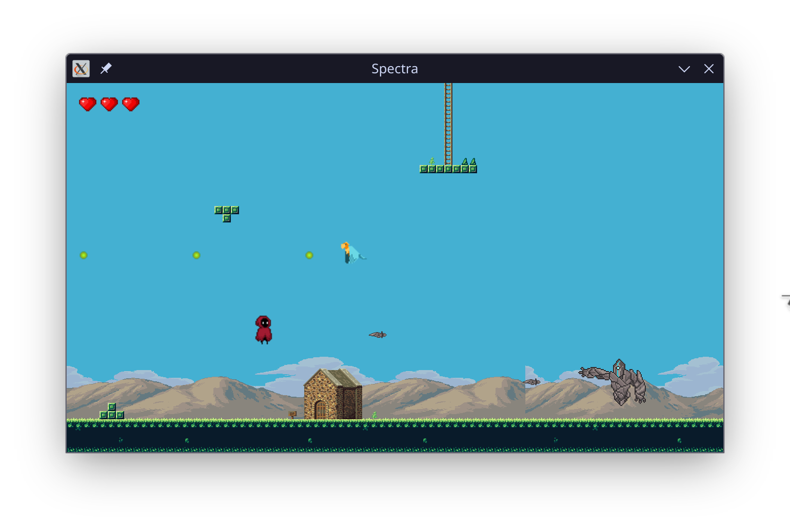

[](https://github.com/thangisme/Spectra/actions/workflows/cmake-sdl2-build.yml)
<br />
<div align="center">

<h3 align="center">Spectra</h3>

  <p align="center">
    Simple shooting game built with SDL2
    <br />
  </p>
</div>


## Gameplay demo
You can view the demo video on [Youtube](https://www.youtube.com/watch?v=O_9oMhhOk9w)

### Screenshot
|  |  |  |
|:-----------------------------------------------------:|:---------------------------------------------------:|:-----------------------------------------------:|
|                      Start menu                       |                  New player screen                  |                   Win screen                    |

|  |  |
|:------------------------------------:|:------------------------------------:|
|                Map 1                 |                Map 2                 |

## Technical design overview
The game's functionalities are organized into separate classes, utilizing Object-Oriented Programming (OOP) principles to make the codebase more modular and maintainable.

The `Game` class acts like the brain of the program, control various parts of the game.
* `TextureManager` class is responsible for loading and rendering textures. 
* `SoundManager` class is responsible for loading and playing sound effects. 
* `InputManager` class is responsible for handling user input.
* The `GameObject` class is the base class for all game objects, which includes the player, enemies, bullets, ... Each of these classes inherits from the `GameObject` class and implements their own functionalities.

The core game loop is implemented in the `Game` class, which handle events -> update game objects -> render game objects -> repeat.
Update loop basically calls the `GameStateManager` class to handle the current state. 
Most of state classes are also inherit from the `MenuState` class which base class is `GameState`. 
These classes call `StateParser` class to parse the data from an external XML file which then render various game objects on the screen. The **[tinyxml2](https://github.com/leethomason/tinyxml2)** library is used to parse the XML file.

The only exception is the `PlayState` class which call the `LevelParser` class instead. This class also parses the data from an external map file, but designed specifically for handling the [Tiled](https://www.mapeditor.org/) map file format. The [base64](https://github.com/ReneNyffenegger/cpp-base64) and [zlib](https://www.zlib.net/) libraries are used to decode the map data.

Due to the space between frame in some object sprite sheets, the collision detection is not pixel-perfect. Instead, the `CollisionManager` class check for outer edges of the object minus a fixed offset to determine the collision.

## Build and Run
### Prerequisites

First, you need to make sure to have the following dependencies installed on your machine:
* [CMake](https://cmake.org/download/)
* [SDL2](https://www.libsdl.org/download-2.0.php)
* [SDL2_image](https://www.libsdl.org/projects/SDL_image/)
* [SDL2_mixer](https://www.libsdl.org/projects/SDL_mixer/)

If you're running on Ubuntu, you can install them by running the following command:
```sh
sudo apt-get install -y libsdl2-dev libsdl2-2.0-0 libsdl2-image-dev libjpeg-dev libwebp-dev libtiff5-dev libsdl2-image-dev libsdl2-image-2.0-0 libmikmod-dev libfishsound1-dev libsmpeg-dev liboggz2-dev libflac-dev libfluidsynth-dev libsdl2-mixer-dev libsdl2-mixer-2.0-0 zlib1g-dev
```

### Build
To build the project, navigate to the root directory and run the following command:
```sh
cmake -S . -B build
cmake --build build
```

### Run
If the build process succeed, you can find the executable file in the `build` directory. To run the game, simply run the following command:
```sh
./build/Spectra
```